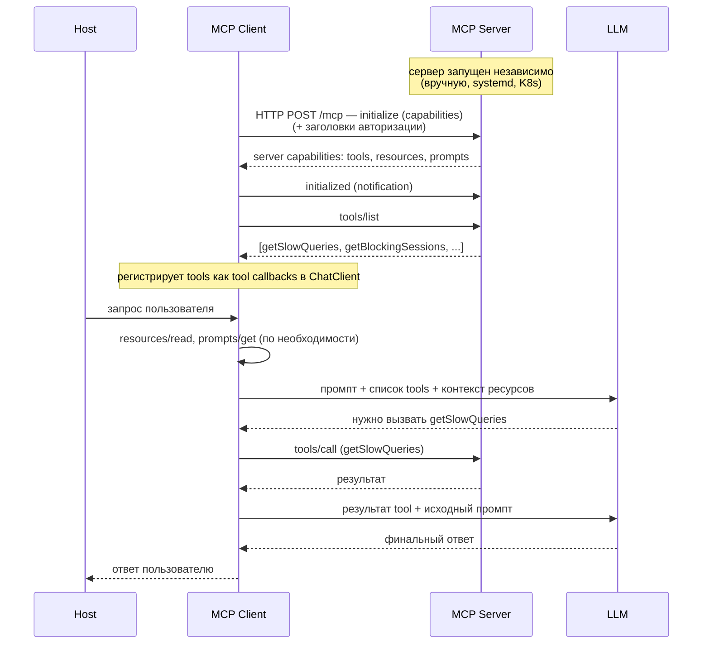

# Как работает MCP

## Архитектура: Host, Client, Server

MCP построен на трёхкомпонентной архитектуре **host-client-server**:

```
┌─────────────────────────────────────────────────────┐
│ Host (Claude Desktop, IDE, ваше приложение)         │
│  ┌───────────────┐                                  │
│  │  MCP Client   │── JSON-RPC ──┐                   │
│  └───────────────┘              │                   │
└─────────────────────────────────┼───────────────────┘
                                  │
                  ┌───────────────▼───────────────────┐
                  │  MCP Server (Spring Boot)         │
                  │  ┌──────┐ ┌──────────┐ ┌───────┐  │
                  │  │Tools │ │Resources │ │Prompts│  │
                  │  └──────┘ └──────────┘ └───────┘  │
                  └───────────────────────────────────┘
```

- **Host** — приложение, в котором живёт LLM: Claude Desktop, VS Code с Copilot, ваш собственный чат-интерфейс. Хост содержит один или несколько MCP-клиентов.
- **MCP Client** — инициирует соединение с сервером, отправляет запросы по JSON-RPC и транслирует результаты обратно хосту.
- **MCP Server** — ваш Spring Boot-сервис, который предоставляет инструменты, ресурсы и промпты. Сервер ничего не знает о том, кто к нему подключился — Claude Desktop, Copilot или ваше приложение.

## Три примитива и кто ими управляет

Tools, Resources и Prompts — три примитива, из которых состоит MCP-сервер. Главное различие между ними — **кто** принимает решение об их использовании.

- **Tool** — вызывается моделью. Когда вы обращаетесь к LLM, она получает список доступных инструментов и сама решает: ответить своими словами или вызвать, например, `getSlowQueries`. Инициатива за LLM.
- **Resource** — вызывается хостом или вашим кодом. Сервер объявляет ресурсы через `resources/list`, но решение, когда загрузить их в контекст LLM, принимает хост или разработчик. Инициатива за приложением.
- **Prompt** — вызывается пользователем. Отображается как slash-команда или пункт меню. Пользователь выбирает сценарий, сервер возвращает массив `messages[]`, и хост вставляет его в чат. Инициатива за пользователем.

## Транспорт: stdio и Streamable HTTP

MCP работает поверх JSON-RPC, а физически сообщения передаются одним из двух способов:

**stdio** — для локального использования. Хост запускает jar-файл как подпроцесс, общение идёт через stdin/stdout. Аутентификация не требуется: это локальный процесс. Пример: Claude Desktop запускает ваш сервер локально.

**Streamable HTTP** — для удалённого подключения. Клиенты обращаются к `POST /mcp` по HTTP. Требуется аутентификация: Origin-валидация или OAuth 2.1. Пример: сервер развёрнут в Kubernetes, клиенты подключаются по URL.

**⚠️ Важно для stdio**: сервер пишет в stdout только JSON-RPC сообщения. `System.out.println`, баннер Spring Boot, любой другой вывод — ломают протокол. Лечится просто:

```yaml
spring.main.banner-mode: off
logging.file.name: /dev/stderr   # Linux: логи уходят в stderr, stdout чист для JSON-RPC
```

> **Примечание:** Streamable HTTP заменил устаревший SSE-транспорт в спецификации MCP 2025 года. Если встретите SSE в старых туториалах — знайте, что сейчас правильно использовать Streamable HTTP.

## Жизненный цикл



Разберём по шагам:

1. **Сервер уже запущен** — в реальных сценариях MCP-сервер поднят независимо от клиента: как systemd-сервис, под в Kubernetes или docker compose. Для локальной разработки со `stdio`-транспортом хост действительно запускает jar как подпроцесс, но для продакшена это скорее исключение.
2. **`initialize`** — клиент подключается к серверу, они обмениваются capabilities. Сервер говорит: «У меня есть tools, resources и prompts». Клиент подтверждает: возможности приняты. Для Streamable HTTP авторизация (Bearer token, API key, OAuth 2.1) передаётся в HTTP-заголовках вместе с каждым запросом — это транспортный уровень, а не отдельный шаг протокола.
3. **`tools/list`** — клиент запрашивает список инструментов. Аналогично можно запросить `resources/list` и `prompts/list`, но tools — единственное, что регистрируется как tool callbacks в `ChatClient`. Ресурсы и промпты запрашиваются ситуативно: когда хосту нужен контекст или пользователь выбрал сценарий.
4. **Регистрация в ChatClient** — магия Spring AI (не часть протокола MCP!). Клиент получает список tools и мапит их в tool callbacks внутри `ChatClient` через `SyncMcpToolCallbackProvider`. Теперь LLM может их вызывать.
5. **Запрос к LLM** — каждый запрос включает описание доступных инструментов. Если хост предварительно загрузил ресурсы (`resources/read`) или применил промпт (`prompts/get`), их содержимое попадает в контекст запроса.
6. **`tools/call`** — если LLM выбрала tool, клиент выполняет вызов на сервере и возвращает результат обратно в LLM.
7. **Финальный ответ** — LLM обрабатывает результат tool и формирует понятный человеку ответ.

## Отладка: MCP Inspector

Прежде чем подключать сервер к Claude Desktop или писать клиента, удобно проверить его автономно. Для этого существует **MCP Inspector**:

```bash
npx @modelcontextprotocol/inspector
```

Инспектор подключается к вашему серверу, показывает список tools/resources/prompts и позволяет вызывать их вручную — без LLM, без хоста, просто JSON-RPC запросы и ответы. Экономит часы отладки.

---

Теперь, когда мы разобрались с архитектурой и протоколом, пора перейти к практике. В следующей части мы рассмотрим два сквозных сценария из банковского ретейла, а затем разберём ключевые фрагменты реализации MCP-сервера на Spring Boot.

> **Документация:** [спецификация MCP](https://spec.modelcontextprotocol.io) и [Spring AI MCP reference](https://docs.spring.io/spring-ai/reference/2.0/api/mcp/mcp-annotations-server.html).
