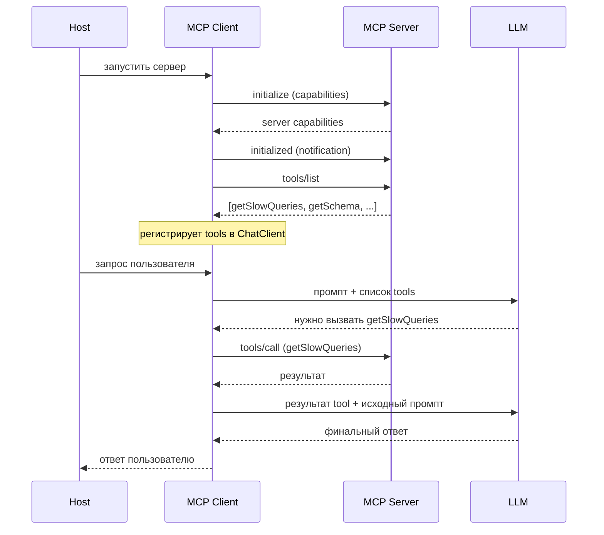

# Как работает MCP

## Архитектура: Host, Client, Server

MCP построен на классической клиент-серверной модели, но с одним важным дополнением — хостом:

```
┌─────────────────────────────────────────────────────┐
│ Host (Claude Desktop, IDE, ваше приложение)           │
│  ┌───────────────┐                                   │
│  │  MCP Client   │── JSON-RPC ──┐                   │
│  └───────────────┘              │                   │
└─────────────────────────────────┼───────────────────┘
                                  │
                  ┌───────────────▼───────────────────┐
                  │  MCP Server (Spring Boot)          │
                  │  ┌──────┐ ┌──────────┐ ┌───────┐ │
                  │  │Tools │ │Resources │ │Prompts│ │
                  │  └──────┘ └──────────┘ └───────┘ │
                  └───────────────────────────────────┘
```

- **Host** — приложение, в котором живёт LLM: Claude Desktop, VS Code с Copilot, ваш собственный чат-интерфейс. Хост содержит один или несколько MCP-клиентов.
- **MCP Client** — инициирует соединение с сервером, отправляет запросы по JSON-RPC и транслирует результаты обратно хосту. Spring AI предоставляет готовую реализацию такого клиента.
- **MCP Server** — ваш Spring Boot-сервис, который предоставляет инструменты, ресурсы и промпты. Сервер ничего не знает о том, кто к нему подключился — Claude Desktop, Copilot или ваше приложение.

## Три концепта: кто что инициирует

Это ключевая вещь, которую важно понять с самого начала. Tool, Resource и Prompt — не просто три названия для «фич сервера». Они отличаются тем, **кто** принимает решение об их использовании:

| Концепт | Инициирует | Как это работает |
|---------|-----------|-------------------|
| **Tool** | LLM | ChatClient передаёт список инструментов в каждом запросе. LLM сама решает: ответить своими словами или вызвать `getSlowQueries` |
| **Resource** | Host / код | Сервер объявляет ресурсы через `resources/list`. Хост (или разработчик) решает, когда загрузить их в контекст LLM |
| **Prompt** | Пользователь | Отображается как slash-команда или пункт меню. Пользователь выбирает → сервер возвращает массив `messages[]` → хост вставляет в чат |

**Tool** — это когда LLM говорит: «Я знаю, что делать, дайте мне вызвать эту функцию».

**Resource** — когда приложение говорит: «LLM нужен контекст, давайте подгрузим схему БД или OpenAPI-спеку».

**Prompt** — когда пользователь говорит: «Объясни мне этот модуль» и выбирает готовый сценарий из меню.

## Транспорт: stdio и Streamable HTTP

MCP работает поверх JSON-RPC, а физически сообщения передаются одним из двух способов:

| | stdio | Streamable HTTP |
|---|---|---|
| **Где используется** | Локально | Удалённо |
| **Как работает** | Хост запускает jar-файл как подпроцесс | HTTP-запросы к `POST /mcp` |
| **Аутентификация** | Не требуется (локальный процесс) | Origin-валидация, OAuth 2.1 |
| **Пример** | Claude Desktop запускает ваш сервер локально | Сервер развёрнут в Kubernetes, клиенты подключаются по URL |

**⚠️ Важно для stdio**: сервер пишет в stdout только JSON-RPC сообщения. `System.out.println`, баннер Spring Boot, любой другой вывод — ломают протокол. Лечится просто:

```yaml
spring.main.banner-mode: off
logging.file.name: /dev/stderr   # Linux: логи уходят в stderr, stdout чист для JSON-RPC
```

> **Примечание:** Streamable HTTP заменил устаревший SSE-транспорт в спецификации MCP 2025 года. Если встретите SSE в старых туториалах — знайте, что сейчас правильно использовать Streamable HTTP.

## Жизненный цикл



Разберём по шагам:

1. **`initialize`** — клиент и сервер обмениваются capabilities. Сервер говорит: «У меня есть tools, resources и prompts». Клиент подтверждает: возможности сервера приняты.
2. **`tools/list`** — клиент запрашивает список доступных инструментов. Это происходит один раз при подключении (или при получении нотификации `tools/listChanged`).
3. **Регистрация в ChatClient** — здесь начинается магия Spring AI (не часть протокола MCP!). MCP-клиент получает список tools и мапит их в function callbacks внутри `ChatClient`. Теперь LLM может их вызывать.
4. **Запрос к LLM** — каждый запрос включает описание доступных инструментов. LLM анализирует промпт и решает: ответить самой или вызвать tool.
5. **`tools/call`** — если LLM выбрала tool, клиент выполняет вызов на сервере и возвращает результат обратно в LLM.
6. **Финальный ответ** — LLM обрабатывает результат tool и формирует понятный человеку ответ.

## Отладка: MCP Inspector

Прежде чем подключать сервер к Claude Desktop или писать клиента, удобно проверить его автономно. Для этого существует **MCP Inspector**:

```bash
npx @modelcontextprotocol/inspector
```

Инспектор подключается к вашему серверу, показывает список tools/resources/prompts и позволяет вызывать их вручную — без LLM, без хоста, просто JSON-RPC запросы и ответы. Экономит часы отладки.

---

Теперь, когда мы разобрались с архитектурой и протоколом, пора перейти к практике. В следующей части мы напишем работающий MCP-сервер на Spring Boot и на живых примерах увидим, как Tools, Resources и Prompts работают в реальном коде.

> **Документация:** [спецификация MCP](https://spec.modelcontextprotocol.io) и [Spring AI MCP reference](https://docs.spring.io/spring-ai/reference/2.0/api/mcp/mcp-annotations-server.html).
