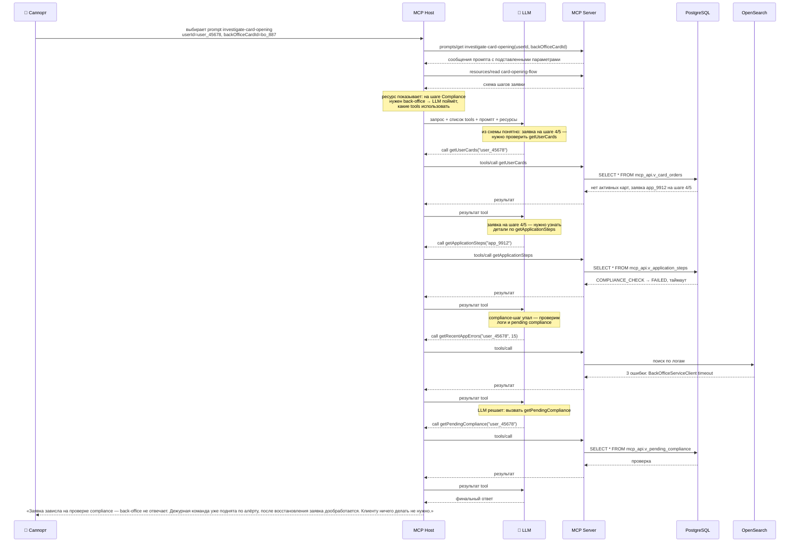
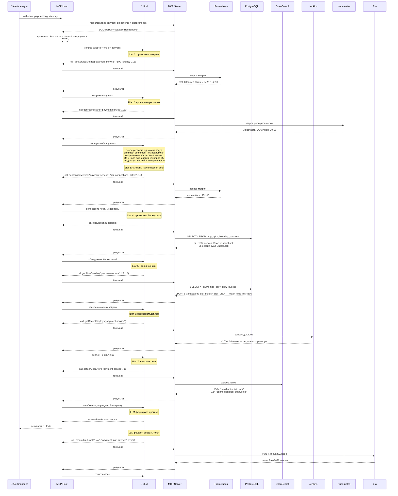

# Примеры реальных задач

Давайте применим теорию из предыдущей главы к практическим сценариям. Представьте банковский ретейл-бизнес: мобильное приложение, пластиковые и виртуальные карты, платежи, переводы. За кулисами — микросервисы.

## Контекст: система из трёх микросервисов

```
┌─────────────────────────────────────────────────────────────────────┐
│                        БАНКОВСКИЙ РЕТЕЙЛ                            │
│                                                                     │
│  ┌──────────────────┐  ┌──────────────────────┐  ┌───────────────┐ │
│  │  payment-service │  │   product-service    │  │ back-office-  │ │
│  │                  │  │                      │  │   service     │ │
│  ├──────────────────┤  ├──────────────────────┤  ├───────────────┤ │
│  │ Платежи          │  │ Жизненный цикл       │  │ Compliance    │ │
│  │ Эквайринг        │  │ продуктов            │  │ Одобрения     │ │
│  │ Переводы         │  │ Заявки на карты      │  │ Ручные решения│ │
│  ├──────────────────┤  ├──────────────────────┤  ├───────────────┤ │
│  │    payments_db   │  │   product_db      │  │ backoffice_db │ │
│  └──────────────────┘  └──────────────────────┘  └───────────────┘ │
└─────────────────────────────────────────────────────────────────────┘
```

Каждый сервис владеет своей базой данных. Никакого прямого доступа между сервисами — только через API. А теперь представьте: вы расследуете инцидент. Чтобы понять, что случилось, вам нужны данные из трёх разных БД, метрики из Grafana и логи из OpenSearch. Без MCP это выглядит так: вы открываете DBeaver, выполняете SQL-запрос, копируете результат, вставляете в чат с LLM. Открываете Grafana, делаете скриншот или копируете цифры — снова вставляете в чат. Открываете OpenSearch, ищете ошибки, копируете, вставляете. LLM анализирует и просит уточнить ещё что-то — вы повторяете круг заново. С MCP вы просто задаёте вопрос в чате, а LLM сама идёт во все системы и собирает факты.

## Сценарий 1: Саппорт расследует проблему с картой

### Что происходит

Клиент звонит в банк: «Пытаюсь открыть виртуальную карту в приложении, три раза нажал — каждый раз ошибка на последнем шаге. Что с моей картой?»

Саппорт открывает чат. У него нет доступа к БД, он не умеет читать логи и не знает, как устроен back-office. Но у него есть MCP.

### Кто что делает

```
                       ┌──────────┐
                       │  САППОРТ │
                       └────┬─────┘
                            │ «Клиент user_45678 не может открыть карту»
                            ▼
┌──────────────────────────────────────────────────────────────┐
│                     MCP HOST (Чат)                            │
│                                                              │
│  Саппорт выбирает prompt из списка:                           │
│  ┌─────────────────────────────────────────────────────┐    │
│  │  PROMPT: investigate-card-opening (с MCP-сервера)     │    │
│  │  ┌──────────────────────────────────────────────┐    │    │
│  │  │ userId = user_45678                          │    │    │
│  │  │ backOfficeCardId = bo_887                    │    │    │
│  │  │                                              │    │    │
│  │  │ «Проверь статус заявки, найди ошибки,        │    │    │
│  │  │  объясни причину и скажи, что делать»        │    │    │
│  │  └──────────────────────────────────────────────┘    │    │
│  └─────────────────────────────────────────────────────┘    │
│                                                              │
│  Хост автоматически подгружает ресурс:                        │
│  ┌─────────────────────────────────────────────────────┐    │
│  │  RESOURCE: card-opening-flow (с MCP-сервера)    │    │
│  │  ┌──────────────────────────────────────────────┐    │    │
│  │  │ Заявка → KYC → Скоринг → Compliance →        │    │    │
│  │  │ Активация                                    │    │    │
│  │  │                                              │    │    │
│  │  │ На шаге Compliance заявка уходит в            │    │    │
│  │  │ back-office → LLM понимает: нужны              │    │    │
│  │  │ getApplicationSteps + getPendingCompliance   │    │    │
│  │  └──────────────────────────────────────────────┘    │    │
│  └─────────────────────────────────────────────────────┘    │
└──────────────────────────┬───────────────────────────────────┘
                           │
                           ▼
┌──────────────────────────────────────────────────────────────┐
│                        MCP SERVER                             │
│                                                              │
│  ┌───────────────┐  ┌──────────────┐  ┌─────────────────┐   │
│  │ getUserCards  │  │ getRecentApp  │  │ getPending      │   │
│  │               │  │    Errors     │  │ Compliance      │   │
│  │ product_db │  │  OpenSearch   │  │ backoffice_db   │   │
│  └───────┬───────┘  └──────┬───────┘  └────────┬────────┘   │
│          │                 │                    │            │
│  ┌───────┴─────────────────┴────────────────────┴────────┐  │
│  │          getApplicationSteps                           │  │
│  │          product_db                                 │  │
│  └───────────────────────────────────────────────────────┘  │
└──────────────────────────────────────────────────────────────┘
```

### Как разворачивается диалог



### Что здесь важно

```
                КТО ПРИНЯЛ РЕШЕНИЕ?

     Tool ←── LLM               «Я знаю, что делать —
                                  дайте мне вызвать функцию»

     Resource ←── Host           «LLM нужен контекст —
                                  давайте подгрузим схему»

     Prompt ←── Пользователь     «Хочу расследовать проблему
                                  с картой — выбираю сценарий»
```

Саппорт не писал SQL, не открывал логи, не дёргал разработчиков. Он задал вопрос на естественном языке — LLM сама прошла по цепочке: проверила заявку → нашла шаг падения → обнаружила ошибки в логах → определила первопричину.

---

## Сценарий 2: Алёрт — система сама пошла расследовать

### Что происходит

Ночь. Никого в офисе. Alertmanager фиксирует: `payment-service p99_latency` выросла с 200ms до 5.2s. Порог — 500ms. Алёрт уровня critical.

```
┌────────────────────────────────────────────────────────────┐
│                      ALERTMANAGER                          │
│                                                            │
│  🚨 ALERT: payment-high-latency                            │
│  📊 value: p99_latency = 5.2s (threshold: 500ms)          │
│  🏷️  labels: {service: payment-service, severity: critical}│
│  ⏰ time: 02:13 UTC                                        │
└────────────────────────┬───────────────────────────────────┘
                         │ webhook
                         ▼
```

Никто не жмёт кнопок. Система сама запускает расследование.

### Кто что делает

```
┌──────────────────────────────────────────────────────────────────┐
│                      MCP HOST (Авто-расследование)                │
│                                                                  │
│  ┌────────────────────────────────────────────────────────────┐  │
│  │  PROMPT: auto-investigate-payment                           │  │
│  │  «Сработал алёрт high-latency. Проверь метрики, БД,         │  │
│  │   логи, деплои. Найди первопричину. Предложи action.        │  │
│  │   Формат: диагноз → доказательства → решение.»              │  │
│  └────────────────────────────────────────────────────────────┘  │
│                                                                  │
│  ┌─────────────────────┐  ┌──────────────────────────────────┐  │
│  │ RESOURCE:            │  │ RESOURCE:                         │  │
│  │ payment-db-schema    │  │ alert-runbook-payment             │  │
│  │                      │  │                                   │  │
│  │ DDL таблиц:          │  │ # High Latency Runbook            │  │
│  │ • transactions       │  │ 1. Проверить pg_stat_statements  │  │
│  │ • settlements        │  │ 2. Проверить pg_stat_activity    │  │
│  │ • payment_methods    │  │ 3. Проверить последние деплои    │  │
│  │ + индексы            │  │ 4. Проверить connection pool     │  │
│  └─────────────────────┘  └──────────────────────────────────┘  │
└──────────────────────────────┬───────────────────────────────────┘
                               │
                               ▼
┌──────────────────────────────────────────────────────────────────┐
│                          MCP SERVER                               │
│                                                                  │
│  ┌─────────────┐ ┌───────────────┐ ┌──────────────┐             │
│  │ getService  │ │ getSlow       │ │ getBlocking  │             │
│  │ Metrics     │ │ Queries       │ │ Sessions     │             │
│  │             │ │               │ │              │             │
│  │ Prometheus  │ │ pg_stat_      │ │ pg_stat_     │             │
│  │ API         │ │ statements    │ │ activity     │             │
│  └─────────────┘ └───────────────┘ └──────────────┘             │
│                                                                  │
│  ┌─────────────┐ ┌───────────────┐ ┌──────────────┐             │
│  │ getRecent   │ │ getService    │ │ getPod       │             │
│  │ Deploys     │ │ Errors        │ │ Restarts     │             │
│  │             │ │               │ │              │             │
│  │ Jenkins API │ │ OpenSearch    │ │ Kubernetes   │             │
│  └─────────────┘ └───────────────┘ └──────────────┘             │
│                                                                  │
│  ┌─────────────┐                                                 │
│  │ createJira  │                                                 │
│  │ Ticket      │                                                 │
│  │             │                                                 │
│  │ Jira API    │                                                 │
│  └─────────────┘                                                 │
└──────────────────────────────────────────────────────────────────┘
```

### Как разворачивается расследование



### Итоговый отчёт LLM

```
┌─────────────────────────────────────────────────────────────────┐
│                                                                  │
│  🔒 ПЕРВОПРИЧИНА: OOM → рестарты → исчерпание                   │
│     connection pool → блокировка таблицы transactions            │
│                                                                  │
│  ┌─────────────────────────────────────────────────────────────┐ │
│  │ 📊 ДОКАЗАТЕЛЬСТВА                                            │ │
│  │                                                              │ │
│  │  • 00:13 — 3 пода payment-service упали с OOMKilled:         │ │
│  │    использование памяти 1.98Gi из лимита 2Gi                 │ │
│  │  • При рестарте пода его batch settlement (pid 8732)         │ │
│  │    не завершился корректно — лок на transactions повис       │ │
│  │  • 00:13–02:13 — за 2 часа блокировка накопила 55           │ │
│  │    ожидающих сессий и исчерпала connection pool              │ │
│  │  • В логах: 3× «java.lang.OutOfMemoryError: Java heap space» │ │
│  │  • p99_latency: 180ms → 5.2s (рост в 29 раз)                │ │
│  │  • pid 8732 держит RowExclusiveLock уже > 5 минут            │ │
│  │  • 55 сессий заблокированы, ждут освобождения                │ │
│  │  • Connection pool: 97/100 (исчерпан)                        │ │
│  │  • Запрос-виновник: UPDATE transactions SET status='SETTLED' │ │
│  │    WHERE batch_id = ? — batch settlement                    │ │
│  │  • 450 ошибок «could not obtain lock» за 15 минут            │ │
│  │  • Последний деплой 14 часов назад — не коррелирует          │ │
│  └─────────────────────────────────────────────────────────────┘ │
│                                                                  │
│  ┌─────────────────────────────────────────────────────────────┐ │
│  │ ✅ ACTION PLAN                                               │ │
│  │                                                              │ │
│  │  1. SELECT pg_terminate_backend(8732)                        │ │
│  │     Убить блокирующую сессию (batch settlement               │ │
│  │     перезапустится автоматически)                            │ │
│  │                                                              │ │
│  │  2. kubectl set resources deployment/payment-service         │ │
│  │     --limits=memory=4Gi                                      │ │
│  │     Увеличить memory limit, чтобы избежать OOM               │ │
│  │                                                              │ │
│  │  3. Проверить JVM heap settings: изменить -Xms2g -Xmx2g      │ │
│  │     на -Xms3g -Xmx3g (80% от memory limit)                   │ │
│  │                                                              │ │
│  │  4. CREATE INDEX CONCURRENTLY                                 │ │
│  │     ON transactions(batch_id)                                │ │
│  │     WHERE status = 'PENDING';                                │ │
│  │     Ускорит batch settlement в 10+ раз                       │ │
│  │                                                              │ │
│  │  5. Увеличить connection pool с 100 до 150                   │ │
│  │     Защита от исчерпания при следующем всплеске              │ │
│  │                                                              │ │
│  │  6. Расследовать размер batch_id 8872 — возможно,            │ │
│  │     слишком много записей в одном батче                      │ │
│  └─────────────────────────────────────────────────────────────┘ │
│                                                                  │
│  📝 Результат отправлен в #incidents Slack                       │
│  🎫 Тикет PAY-8872 создан в Jira через createJiraTicket          │
│                                                                  │
└─────────────────────────────────────────────────────────────────┘
```

### Что здесь важно

```
    БЕЗ УЧАСТИЯ ЧЕЛОВЕКА:

    Alertmanager ──→ MCP Host ──→ LLM ──→ 7 тулов ──→ диагноз + action

    Система:
    • Сама получила алёрт
    • Сама опросила Prometheus / Kubernetes / PostgreSQL / OpenSearch / Jenkins
    • Сама создала тикет в Jira
    • Сама сопоставила факты и нашла первопричину
    • Сама предложила конкретные команды для исправления
    • Сама отправила результат туда, где его увидят
```

Обратите внимание: LLM не просто ответила «у вас проблемы с БД». Она прошла по цепочке доказательств — от алёрта до конкретного pid и запроса. Это возможно только потому, что MCP дал ей доступ к реальным данным, а не к документации трёхлетней давности.

---

## Безопасность: почему LLM не видит сырые данные

Вы могли заметить во всех диаграммах странные названия: `mcp_api.v_blocking_sessions`, `mcp_api.v_slow_queries`. Это не опечатка. Это архитектурное решение.

### Проблема

У LLM не должно быть прямого доступа к таблицам с данными клиентов. Номера карт, email-адреса, IP, суммы транзакций — всё это PII, которое регулируется GDPR, PCI DSS и внутренними политиками банка.

### Решение: схема mcp_api

```
┌─────────────────────────────────────────────────────────────────┐
│                   PostgreSQL (payments_db)                       │
│                                                                  │
│  ┌──────────────────────────────────────┐                       │
│  │           schema: public              │  ← LLM НЕ ВИДИТ       │
│  │                                      │                       │
│  │  transactions                        │                       │
│  │  ├─ id                               │                       │
│  │  ├─ card_number       ← PII          │                       │
│  │  ├─ card_holder       ← PII          │                       │
│  │  ├─ ip_address        ← PII          │                       │
│  │  ├─ device_fingerprint ← PII         │                       │
│  │  ├─ amount                           │                       │
│  │  ├─ status                           │                       │
│  │  └─ ...                              │                       │
│  │                                      │                       │
│  │  settlements                         │                       │
│  │  payment_methods                     │                       │
│  └──────────────────────────────────────┘                       │
│                                                                  │
│  ┌──────────────────────────────────────┐                       │
│  │          schema: mcp_api              │  ← LLM ВИДИТ ТОЛЬКО   │
│  │                                      │     ЭТО                │
│  │  v_transactions (VIEW)               │                       │
│  │  ├─ id                               │                       │
│  │  ├─ status                           │                       │
│  │  ├─ amount                           │                       │
│  │  ├─ merchant_category                │                       │
│  │  ├─ merchant_masked   ← OZ***        │  PII замаскирован     │
│  │  ├─ batch_id                         │                       │
│  │  ├─ settling_status                  │                       │
│  │  ├─ error_code                       │                       │
│  │  └─ WHERE created_at > NOW() - 30d   │  Ограничение по дате  │
│  │                                      │                       │
│  │  v_blocking_sessions (VIEW)          │                       │
│  │  ├─ blocked_pid                      │                       │
│  │  ├─ blocked_query_short ← 200 симв.  │  Запросы обрезаны     │
│  │  ├─ blocking_pid                     │                       │
│  │  ├─ blocking_duration                │                       │
│  │  └─ WHERE datname = 'payments_db'    │  Только своя БД       │
│  │                                      │                       │
│  │  v_slow_queries (VIEW)               │                       │
│  │  ├─ query_short ← 500 симв.          │                       │
│  │  ├─ calls                            │                       │
│  │  ├─ mean_time_ms                     │                       │
│  │  ├─ total_time_ms                    │                       │
│  │  └─ disk_read_kb                     │                       │
│  └──────────────────────────────────────┘                       │
└─────────────────────────────────────────────────────────────────┘
```

Аналогичные VIEW создаются в `product_db` (`v_card_orders`, `v_application_steps`) и `backoffice_db` (`v_pending_compliance`) — везде с маскировкой PII и ограничением по датам.

### Модель доступа

```
                        ┌───────────────┐
                        │      LLM      │
                        │  Видит только │
                        │  то, что Tool │
                        │  решил вернуть│
                        └───────┬───────┘
                                │ JSON-RPC
                        ┌───────┴───────┐
                        │  MCP Server   │
                        │               │
                        │  User:        │
                        │  mcp_readonly │
                        │               │
                        │  GRANT:       │
                        │  SELECT on    │
                        │  mcp_api.*    │
                        │               │
                        │  REVOKE:      │
                        │  public.*     │
                        │  pg_catalog.* │
                        │               │
                        │  Лимит:       │
                        │  5 connections│
                        └───────┬───────┘
                                │ JDBC
                        ┌───────┴───────┐
                        │  PostgreSQL   │
                        │               │
                        │  mcp_api.*    │
                        │  (только      │
                        │   VIEW)       │
                        │               │
                        │  public.*     │
                        │  (недоступна) │
                        └───────────────┘
```

### Что даёт каждый уровень

```
┌─────────────────────┬──────────────────────────────────────────┐
│ Уровень защиты       │ Что предотвращает                        │
├─────────────────────┼──────────────────────────────────────────┤
│ VIEW с маскировкой  │ LLM не видит PII: номера карт, email,    │
│                     │ IP, паспортные данные                     │
├─────────────────────┼──────────────────────────────────────────┤
│ VIEW с фильтрацией  │ LLM не получает дамп всей БД. Только     │
│                     │ последние 30 дней. Только обрезанные      │
│                     │ сообщения об ошибках                      │
├─────────────────────┼──────────────────────────────────────────┤
│ Только SELECT       │ LLM не может INSERT/UPDATE/DELETE/TRUNCATE│
│                     │ Даже если кто-то скомпрометирует сервер   │
├─────────────────────┼──────────────────────────────────────────┤
│ REVOKE на public    │ LLM не видит сырые таблицы. Только VIEW   │
├─────────────────────┼──────────────────────────────────────────┤
│ CONNECTION LIMIT    │ Защита от исчерпания соединений. Даже     │
│                     │ при баге в MCP-сервере БД не упадёт       │
├─────────────────────┼──────────────────────────────────────────┤
│ log_statement       │ Все запросы от mcp_readonly пишутся в лог.│
│                     │ Полный аудит: кто, когда, что запросил    │
└─────────────────────┴──────────────────────────────────────────┘
```

### Почему это важно именно для MCP

Обычный REST API тоже может маскировать PII и ограничивать доступ. Но MCP добавляет уникальный риск: **LLM сама решает, какие Tool вызвать и какие параметры передать**. Вы не контролируете последовательность вызовов. LLM может, теоретически, вызвать тулы в таком порядке и с такими параметрами, которые вы не предусмотрели.

Защита на уровне VIEW означает: что бы LLM ни придумала — она физически не может прочитать `card_number` или удалить строку из `transactions`. Безопасность здесь не «мы надеемся, что LLM будет хорошей», а «мы спроектировали систему так, что у LLM нет выбора».

---

## Сравнение сценариев

```
                    СЦЕНАРИЙ 1                    СЦЕНАРИЙ 2
                    ──────────                    ──────────

  Кто запустил?     Саппорт                       Alertmanager (webhook)

  Цель              Ответить клиенту              Найти и исправить проблему

  Tool              4 (БД + логи)                 7 (БД + метрики +
                                                   K8s + логи + деплои
                                                   + Jira)

  Resource          Схема шагов заявки            DDL-схема + Runbook

  Prompt            investigate-card-opening        auto-investigate-payment

  Результат         «Заявка зависла на            «🔒 pid 8732 →
                     compliance, ждите»            pg_terminate_backend +
                                                   индекс + pool»

  Ключевое          Человек + LLM =               Система + LLM =
  отличие           быстрее, чем человек          расследование без
                     в одиночку                    участия человека
```

Оба сценария работают на одном MCP-сервере. Один набор Tool, Resource и Prompt обслуживает и ручные расследования саппорта, и автоматические ответы на алёрты. Именно в этом суть MCP: один сервер — разные потребители.

---

Теперь, когда мы увидели, как MCP выглядит на практике, пора перейти к реализации. В следующей главе мы разберём ключевые фрагменты кода — tools, resources и prompts, которые вы только что видели на диаграммах.
